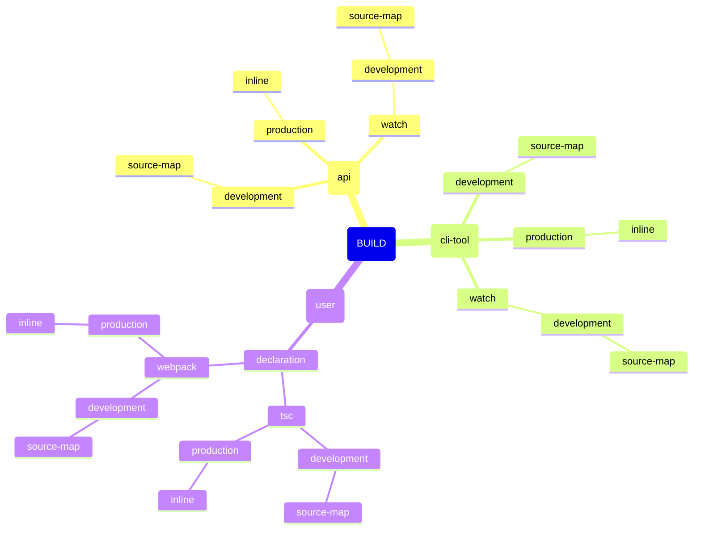

# Build script map

```mermaid
mindmap
  root(BUILD)
    App(api)
      development
        source-map
      production
        inline
      watch
        development
          source-map
    App(cli-tool)
      development
        source-map
      production
        inline
      watch
        development
          source-map
    Modules(user)
      declaration
        tsc
          development
            source-map
          production
            inline
        webpack
          development
            source-map
          production
            inline
```